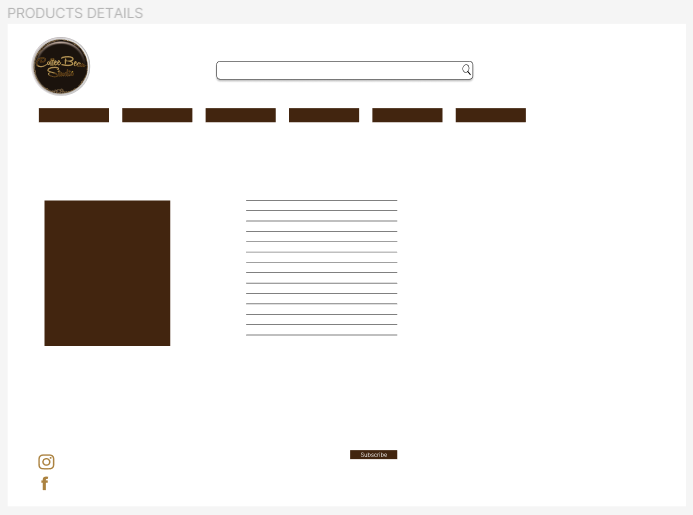

# COFFEEBEANSTUDIO1809

The live link can be found here [ CoffeeBeanStudio1809 website ](https://coffeebeanstudio1809-7c1114e7ca53.herokuapp.com/)

Welcome to Coffeebeanstudio1809, your ultimate destination for innovative promotional product design solutions. Our mission is to revolutionize the way businesses and individuals approach promotions and gifting. Unlike traditional methods, we bring a fresh and creative approach to the table, ensuring your promotional efforts are not only effective but also memorable.
At Coffeebeanstudio1809, we understand the power of thoughtful and well-designed promotional products. Our team work tirelessly to curate a diverse range of product ideas that cater to various occasions, including birthdays, weddings, business events, parties, holy communions, and more. We believe that every occasion deserves a unique touch, and our designs reflect just that.
Our website help you easily explore a diverse range of products and access detailed information, including pricing and ratings.
Register and create an account with seamless login/logout options. Recover forgotten passwords and receive email confirmations for smooth account management. Sort products by rating, price, and category for a tailored shopping experience. Effortlessly search for products by name or description. Review your shopping bag, adjust quantities, and securely enter payment information. Trust in the safety and security of your personal and payment details. Verify orders through on-screen and email confirmations. Admins can add, edit, and remove products seamlessly.
Join Coffeebeanstudio1809 for a simplified design journey, whether for business branding or special events. Transform your ideas into captivating designs with a few clicks.

Rest assured, I've rigorously tested this website across various platforms to ensure its seamless functionality.
Here's your deployed site as an example:
https://ui.dev/amiresponsive?url=https://coffeebeanstudio1809-7c1114e7ca53.herokuapp.com


## UX

### Colour Scheme

- `#42250F` used for primary text.
- `#ab8240` used for description highlights.
- `#fefcfa` used for the background of the page.

I checked colour scheme using "contrast checker".

https://accessibleweb.com/color-contrast-checker/

### Typography

- [Bebas Neue](https://fonts.google.com/specimen/Bebas+Neue) was used for the primary headers and titles.

- [Tangerine](https://fonts.google.com/specimen/Tangerine) was used for all other highlight text.

- [Font Awesome](https://fontawesome.com) icons were used throughout the site, such as the social media icons in the footer.

## User Stories

### New Site Users

- As a new site user, I would like to be able to view a list of products, so that I can select some to purchase.
- As a new site user, I would like to view individual product details, so that I can identify the price, description, product rating.
- As a new site user, I would like to quickly identify deals, clearance items and special offers, so that I can take advantage of special savings on products user like to purchase.
- As a new site user, I would like to easily view the total of my purchases at any time , so that I can avoid spending too much.
- As a new site user, I would like to sort the list of available products, so that I can easily identify the best rated, best priced and categorically sorted products.

### Returning Site Users

- As a returning site user, I would like to easily register for an account, so that I can have a personal account and be able to view my profile.
- As a returning site user, I would like to easily login or logout, so that I can access my personal account information.
- As a returning site user, I would like to easily recover my password in case user forget it, so that I can recover access to my account.
- As a returning site user, I would like to receive an email confirmation after registering , so that I can verify that my account registration was successful.
- As a returning site user, I would like to have a personalized user profile, so that I can view my personal order history and order confirmation and save my payment information.

### Site Admin

- As a site administrator, I should be able to add a product, so that I can add new items to user store.
- As a site administrator, I should be able to edit a product, so that I can change product prices, descriptions, images, and other product criteria.
- As a site administrator, I should be able to update a product, so that I can change product prices, descriptions, images, and other product criteria.
- As a site administrator, I should be able to delete a product, so that I can remove items that are no longer for sale.

## Personas


## Wireframes

To follow best practice, wireframes were developed for mobile, tablet, and desktop sizes.
I've used [Figma](https://www.figma.com/) to design my site wireframes.

### Home Page Paper Wireframes

| Size | Screenshot |
| --- | --- |
| Mobile |  |
| Mobile |  |
| Mobile |  |

### Home Page Wireframes

| Size | Screenshot |
| --- | --- |
| Mobile |  |
| Tablet |  |
| Desktop |  |

### Product View Page Wireframes

| Size | Screenshot |
| --- | --- |
| Mobile |  |
| Tablet |  |
| Desktop |  |

### Product Detail Page Wireframes

| Size | Screenshot |
| --- | --- |
| Mobile |  |
| Tablet |  |
| Desktop |  |


**For more details of whole UX Design process see** [UX research](documentation/CoffeeBeanStudio1809%20-%20PP5.pdf)


## Features

### Existing Features

**Viewing and Navigation:**

- Viewing a List of Products

  - Users can easily explore and select products they are interested in purchasing.

- View Individual Product Details

  - Users can make informed decisions by accessing essential product information like price, description, and ratings.

- Quickly Identify Deals and Special Offers

  - Users can take advantage of cost savings by identifying and purchasing items on sale or with special offers.

- Easily View Total Purchases

  - Users can keep track of their spending and avoid overspending.


**Registration and User Accounts:**

- Easily Register for an Account

  - Users can create a personalized account, enhancing their shopping experience and enabling order tracking.

- Easily Login or Logout

  - Users can access their account information conveniently and securely.

- Password Recovery

  - Users can regain access to their accounts if they forget their passwords.

- Email Confirmation

  - Users receive confirmation of successful registration, ensuring their account setup is complete.

- Personalized User Profile

  - Users can view order history, order confirmations, and save payment information for faster checkouts.


**Sorting and Searching:**

- Sort Available Products

  - Users can easily find products based on criteria like ratings, prices, and categories.
  
- Sort Specific Category

  - Users can quickly identify the best-priced or best-rated products within a specific category.

- Sort Multiple Categories

  - Users can efficiently compare and select products across different broad categories.

- Search by Name or Description

  - Users can find specific products they're interested in.

- Search Visibility

  - Users can quickly access search results and decide if the desired product is available.


**Purchasing and Checkout:**

- Select Size and Quantity

  - Users can accurately choose the right product variant, size, and quantity.

- View Items in Cart

  - Users can review their cart to ensure they have selected the correct items and calculate the total cost.

- Adjust Item Quantity

  - Users can easily modify the quantity of items in their cart.

- Enter Payment Information

  - Users can securely provide payment details for a hassle-free checkout process.

- Data Security

  - Users can confidently make purchases knowing their personal and payment information is secure.

- Order Confirmation

  - Users receive an immediate confirmation to verify their order details before finalizing the purchase.

- Email Confirmation

  - Users get an email confirmation of their order for record-keeping.


**Admin and Store Management:**

- Add, Edit, Delete Products

  - Store administrators can efficiently manage the product catalog by adding, updating, or removing items.


### Future Features

**Shipping and Tracking:**

- Choose Shipping Options

  - Users can select preferred shipping methods and delivery options for their orders.

- Track Order Status

  - Users can easily track the progress and current status of their orders in real-time.

- Receive Shipping Updates

  - Users receive notifications and updates on shipping and delivery, including estimated delivery times.

- Manage Returns and Refunds

  - Users can initiate returns and refunds for products that don't meet their expectations or have issues.

**Product Reviews and Ratings:**

- Leave Product Reviews

  - Users can provide feedback and reviews on products they've purchased to help others make informed decisions.

- Read User Reviews

  - Users can read reviews and testimonials from other customers to gather insights about products.

**Customer Support and Help Center:**

- Access Help Center

  - Users can access a comprehensive help center with FAQs, guides, and troubleshooting resources.

- Live Chat Support

  - Users can engage in real-time chat with customer support agents for immediate assistance.

- Request Order Help

  - Users can submit requests for order-related issues, such as missing items or order changes.

## Tools & Technologies Used

- [HTML](https://en.wikipedia.org/wiki/HTML) used for the main site content.
- [CSS](https://en.wikipedia.org/wiki/CSS) used for the main site design and layout.
- [CSS :root variables](https://www.w3schools.com/css/css3_variables.asp) used for reusable styles throughout the site.
- [JavaScript](https://www.javascript.com) used for user interaction on the site.
- [Python](https://www.python.org) used as the back-end programming language.
- [Git](https://git-scm.com) used for version control. (`git add`, `git commit`, `git push`)
- [GitHub](https://github.com) used for secure online code storage.
- [GitHub Pages](https://pages.github.com) used for hosting the deployed front-end site.
- [Gitpod](https://gitpod.io) used as a cloud-based IDE for development.
- [Bootstrap](https://getbootstrap.com) used as the front-end CSS framework for modern responsiveness and pre-built components.
- [Materialize](https://materializecss.com) used as the front-end CSS framework for modern responsiveness and pre-built components.
- [Flask](https://flask.palletsprojects.com) used as the Python framework for the site.
- [Django](https://www.djangoproject.com) used as the Python framework for the site.
- [PostgreSQL](https://www.postgresql.org) used as the relational database management.
- [Heroku](https://www.heroku.com) used for hosting the deployed back-end site.
- [Stripe](https://stripe.com) used for online secure payments of ecommerce products/services.
- [AWS S3](https://aws.amazon.com/s3) used for online static file storage.

## Database Design


```python
class Product(models.Model):
    category = models.ForeignKey('Category', null=True, blank=True, on_delete=models.SET_NULL)
    sku = models.CharField(max_length=254, null=True, blank=True)
    name = models.CharField(max_length=254)
    description = models.TextField()
    has_sizes = models.BooleanField(default=False, null=True, blank=True)
    banner = models.BooleanField(default=False, null=True, blank=True)
    sign = models.BooleanField(default=False, null=True, blank=True)
    badge = models.BooleanField(default=False, null=True, blank=True)
    busincard = models.BooleanField(default=False, null=True, blank=True)
    pillow = models.BooleanField(default=False, null=True, blank=True)
    towel = models.BooleanField(default=False, null=True, blank=True)
    keyring = models.BooleanField(default=False, null=True, blank=True)
    price = models.DecimalField(max_digits=6, decimal_places=2)
    rating = models.DecimalField(max_digits=6, decimal_places=2, null=True, blank=True)
    image_url = models.URLField(max_length=1024, null=True, blank=True)
    image = models.ImageField(null=True, blank=True)

    def __str__(self):
        return self.name

```


- Table: **Product**

    | **PK** | **id** (unique) | Type | Notes |
    | --- | --- | --- | --- |
    | **FK** | category | ForeignKey | FK to **Category** model |
    | | sku | CharField | |
    | | name | CharField | |
    | | description | TextField | |
    | | has_sizes | BooleanField | |
    | | price | DecimalField | |
    | | rating | DecimalField | |
    | | image_url | URLField | |
    | | image | ImageField | |

## Agile Development Process

### GitHub Projects

[GitHub Projects](https://github.com/Alena18/Coffeebeanstudio1809/projects) served as an Agile tool for this project.
It isn't a specialized tool, but with the right tags and project creation/issue assignments, it can be made to work.


### GitHub Issues

[GitHub Issues](https://github.com/Alena18/Coffeebeanstudio1809/issues) served as an another Agile tool.
There, I used my own **User Story Template** to manage user stories.

    

### MoSCoW Prioritization

I've decomposed my Epics into stories prior to prioritizing and implementing them.
Using this approach, I was able to apply the MoSCow prioritization and labels to my user stories within the Issues tab.

- **Must Have**: guaranteed to be delivered (*max 60% of stories*)
- **Should Have**: adds significant value, but not vital (*the rest ~20% of stories*)
- **Could Have**: has small impact if left out (*20% of stories*)
- **Won't Have**: not a priority for this iteration

## Ecommerce Business Model

This site sells goods to individual customers, and therefore follows a `Business to Customer` model.
It is of the simplest **B2C** forms, as it focuses on individual transactions, and doesn't need anything
such as monthly/annual subscriptions.

It is still in its early development stages, although it already has a newsletter, and links for social media marketing.

Social media can potentially build a community of users around the business, and boost site visitor numbers,
especially when using larger platforms such a Facebook.

A newsletter list can be used by the business to send regular messages to site users.
For example, what items are on special offer, new items in stock,
updates to business hours, notifications of events, and much more!

## Search Engine Optimization (SEO) & Social Media Marketing

### Keywords

I've identified some appropriate keywords to align with my site, that should help users
when searching online to find my page easily from a search engine.
This included a series of the following keyword types

- Short-tail (head terms) keywords
- Long-tail keywords

I also played around with [Word Tracker](https://www.wordtracker.com) a bit
to check the frequency of some of my site's primary keywords (only until the free trial expired).

### Sitemap

I've used [XML-Sitemaps](https://www.xml-sitemaps.com) to generate a sitemap.xml file.
This was generated using my deployed site URL: https://coffeebeanstudio1809-7c1114e7ca53.herokuapp.com

After it finished crawling the entire site, it created a
[sitemap.xml](sitemap.xml) which I've downloaded and included in the repository.

### Robots

I've created the [robots.txt](robots.txt) file at the root-level.
Inside, I've included the default settings:

```
User-agent: *
Disallow:
Sitemap: https://coffeebeanstudio1809-7c1114e7ca53.herokuapp.com/sitemap.xml
```

Further links for future implementation:
- [Google search console](https://search.google.com/search-console)
- [Creating and submitting a sitemap](https://developers.google.com/search/docs/advanced/sitemaps/build-sitemap)
- [Managing your sitemaps and using sitemaps reports](https://support.google.com/webmasters/answer/7451001)
- [Testing the robots.txt file](https://support.google.com/webmasters/answer/6062598)

### Social Media Marketing

Creating a strong social base (with participation) and linking that to the business site can help drive sales.
Using more popular providers with a wider user base, such as Facebook, typically maximizes site views.

I've created a mockup Facebook business account using the
[Balsamiq template](https://code-institute-org.github.io/5P-Assessments-Handbook/files/Facebook_Mockups.zip)
provided by Code Institute.


The live link can be found here [ CoffeeBeanStudio1809 facebook page ](https://www.facebook.com/people/Coffeebeanstudio1809/100095074400849/)

### Newsletter Marketing

I have incorporate a newsletter sign-up form on my application, to allow users to supply their
email address if they are interested in learning more. 

Option 1 (MailChimp):
- Sign up for a Mailchimp account
- This allows up to 2,500 subscription email sends per month
- Incorporate the code and scripts into your project like in the CI lessons.

## Testing

For all testing, please refer to the [TESTING.md](TESTING.md) file.

## Deployment


The live deployed application can be found deployed on [Heroku](https://coffeebeanstudio1809-7c1114e7ca53.herokuapp.com).

### ElephantSQL Database

This project uses [ElephantSQL](https://www.elephantsql.com) for the PostgreSQL Database.

To obtain your own Postgres Database, sign-up with your GitHub account, then follow these steps:
- Click **Create New Instance** to start a new database.
- Provide a name (this is commonly the name of the project: Coffeebeanstudio1809).
- Select the **Tiny Turtle (Free)** plan.
- You can leave the **Tags** blank.
- Select the **Region** and **Data Center** closest to you.
- Once created, click on the new database name, where you can view the database URL and Password.

### Amazon AWS

This project uses [AWS](https://aws.amazon.com) to store media and static files online, due to the fact that Heroku doesn't persist this type of data.

Once you've created an AWS account and logged-in, follow these series of steps to get your project connected.
Make sure you're on the **AWS Management Console** page.

#### S3 Bucket

- Search for **S3**.
- Create a new bucket, give it a name (matching your Heroku app name), and choose the region closest to you.
- Uncheck **Block all public access**, and acknowledge that the bucket will be public (required for it to work on Heroku).
- From **Object Ownership**, make sure to have **ACLs enabled**, and **Bucket owner preferred** selected.
- From the **Properties** tab, turn on static website hosting, and type `index.html` and `error.html` in their respective fields, then click **Save**.
- From the **Permissions** tab, paste in the following CORS configuration:

	```shell
	[
		{
			"AllowedHeaders": [
				"Authorization"
			],
			"AllowedMethods": [
				"GET"
			],
			"AllowedOrigins": [
				"*"
			],
			"ExposeHeaders": []
		}
	]
	```

- Copy your **ARN** string.
- From the **Bucket Policy** tab, select the **Policy Generator** link, and use the following steps:
	- Policy Type: **S3 Bucket Policy**
	- Effect: **Allow**
	- Principal: `*`
	- Actions: **GetObject**
	- Amazon Resource Name (ARN): **paste-your-ARN-here**
	- Click **Add Statement**
	- Click **Generate Policy**
	- Copy the entire Policy, and paste it into the **Bucket Policy Editor**

		```shell
		{
			"Id": "Policy1234567890",
			"Version": "2012-10-17",
			"Statement": [
				{
					"Sid": "Stmt1234567890",
					"Action": [
						"s3:GetObject"
					],
					"Effect": "Allow",
					"Resource": "arn:aws:s3:::your-bucket-name/*"
					"Principal": "*",
				}
			]
		}
		```

	- Before you click "Save", add `/*` to the end of the Resource key in the Bucket Policy Editor (like above).
	- Click **Save**.
- From the **Access Control List (ACL)** section, click "Edit" and enable **List** for **Everyone (public access)**, and accept the warning box.
	- If the edit button is disabled, you need to change the **Object Ownership** section above to **ACLs enabled** (mentioned above).

#### IAM

Back on the AWS Services Menu, search for and open **IAM** (Identity and Access Management).
Once on the IAM page, follow these steps:

- From **User Groups**, click **Create New Group**.
	- Suggested Name: `group-coffeebeanstudio1809` (group + the project name)
- Tags are optional, but you must click it to get to the **review policy** page.
- From **User Groups**, select your newly created group, and go to the **Permissions** tab.
- Open the **Add Permissions** dropdown, and click **Attach Policies**.
- Select the policy, then click **Add Permissions** at the bottom when finished.
- From the **JSON** tab, select the **Import Managed Policy** link.
	- Search for **S3**, select the `AmazonS3FullAccess` policy, and then **Import**.
	- You'll need your ARN from the S3 Bucket copied again, which is pasted into "Resources" key on the Policy.

		```shell
		{
			"Version": "2012-10-17",
			"Statement": [
				{
					"Effect": "Allow",
					"Action": "s3:*",
					"Resource": [
						"arn:aws:s3:::your-bucket-name",
						"arn:aws:s3:::your-bucket-name/*"
					]
				}
			]
		}
		```
	
	- Click **Review Policy**.
	- Suggested Name: `policy-coffeebeanstudio1809` (policy + the project name)
	- Provide a description:
		- "Access to S3 Bucket for coffeebeanstudio1809 static files."
	- Click **Create Policy**.
- From **User Groups**, click your "group-coffeebeanstudio1809".
- Click **Attach Policy**.
- Search for the policy you've just created ("policy-coffeebeanstudio1809") and select it, then **Attach Policy**.
- From **User Groups**, click **Add User**.
	- Suggested Name: `user-coffeebeanstudio1809` (user + the project name)
- For "Select AWS Access Type", select **Programmatic Access**.
- Select the group to add your new user to: `group-coffeebeanstudio1809`
- Tags are optional, but you must click it to get to the **review user** page.
- Click **Create User** once done.
- You should see a button to **Download .csv**, so click it to save a copy on your system.
	- **IMPORTANT**: once you pass this page, you cannot come back to download it again, so do it immediately!
	- This contains the user's **Access key ID** and **Secret access key**.
	- `AWS_ACCESS_KEY_ID` = **Access key ID**
	- `AWS_SECRET_ACCESS_KEY` = **Secret access key**

#### Final AWS Setup

- If Heroku Config Vars has `DISABLE_COLLECTSTATIC` still, this can be removed now, so that AWS will handle the static files.
- Back within **S3**, create a new folder called: `media`.
- Select any existing media images for your project to prepare them for being uploaded into the new folder.
- Under **Manage Public Permissions**, select **Grant public read access to this object(s)**.
- No further settings are required, so click **Upload**.

### Stripe API

This project uses [Stripe](https://stripe.com) to handle the ecommerce payments.

Once you've created a Stripe account and logged-in, follow these series of steps to get your project connected.

- From your Stripe dashboard, click to expand the "Get your test API keys".
- You'll have two keys here:
	- `STRIPE_PUBLIC_KEY` = Publishable Key (starts with **pk**)
	- `STRIPE_SECRET_KEY` = Secret Key (starts with **sk**)

As a backup, in case users prematurely close the purchase-order page during payment, we can include Stripe Webhooks.

- From your Stripe dashboard, click **Developers**, and select **Webhooks**.
- From there, click **Add Endpoint**.
	- `https://coffeebeanstudio1809-7c1114e7ca53.herokuapp.com/checkout/wh/`
- Click **receive all events**.
- Click **Add Endpoint** to complete the process.
- You'll have a new key here:
	- `STRIPE_WH_SECRET` = Signing Secret (Wehbook) Key (starts with **wh**)

### Gmail API

This project uses [Gmail](https://mail.google.com) to handle sending emails to users for account verification and purchase order confirmations.

Once you've created a Gmail (Google) account and logged-in, follow these series of steps to get your project connected.

- Click on the **Account Settings** (cog icon) in the top-right corner of Gmail.
- Click on the **Accounts and Import** tab.
- Within the section called "Change account settings", click on the link for **Other Google Account settings**.
- From this new page, select **Security** on the left.
- Select **2-Step Verification** to turn it on. (verify your password and account)
- Once verified, select **Turn On** for 2FA.
- Navigate back to the **Security** page, and you'll see a new option called **App passwords**.
- This might prompt you once again to confirm your password and account.
- Select **Mail** for the app type.
- Select **Other (Custom name)** for the device type.
	- Any custom name, such as "Django" or Coffeebeanstudio1809
- You'll be provided with a 16-character password (API key).
	- Save this somewhere locally, as you cannot access this key again later!
	- `EMAIL_HOST_PASS` = user's 16-character API key
	- `EMAIL_HOST_USER` = user's own personal Gmail email address

### Heroku Deployment

This project uses [Heroku](https://www.heroku.com), a platform as a service (PaaS) that enables developers to build, run, and operate applications entirely in the cloud.

Deployment steps are as follows, after account setup:

- Select **New** in the top-right corner of your Heroku Dashboard, and select **Create new app** from the dropdown menu.
- Your app name must be unique, and then choose a region closest to you (EU or USA), and finally, select **Create App**.
- From the new app **Settings**, click **Reveal Config Vars**, and set your environment variables.

| Key | Value |
| --- | --- |
| `AWS_ACCESS_KEY_ID` | user's own value |
| `AWS_SECRET_ACCESS_KEY` | user's own value |
| `DATABASE_URL` | user's own value |
| `DISABLE_COLLECTSTATIC` | 1 (*this is temporary, and can be removed for the final deployment*) |
| `EMAIL_HOST_PASS` | user's own value |
| `EMAIL_HOST_USER` | user's own value |
| `SECRET_KEY` | user's own value |
| `STRIPE_PUBLIC_KEY` | user's own value |
| `STRIPE_SECRET_KEY` | user's own value |
| `STRIPE_WH_SECRET` | user's own value |
| `USE_AWS` | True |

Heroku needs two additional files in order to deploy properly.
- requirements.txt
- Procfile

You can install this project's **requirements** (where applicable) using:
- `pip3 install -r requirements.txt`

If you have your own packages that have been installed, then the requirements file needs updated using:
- `pip3 freeze --local > requirements.txt`

The **Procfile** can be created with the following command:
- `echo web: gunicorn app_name.wsgi > Procfile`
- *replace **app_name** with the name of your primary Django app name; the folder where settings.py is located*

For Heroku deployment, follow these steps to connect your own GitHub repository to the newly created app:

Either:
- Select **Automatic Deployment** from the Heroku app.

Or:
- In the Terminal/CLI, connect to Heroku using this command: `heroku login -i`
- Set the remote for Heroku: `heroku git:remote -a app_name` (replace *app_name* with your app name)
- After performing the standard Git `add`, `commit`, and `push` to GitHub, you can now type:
	- `git push heroku main`

The project should now be connected and deployed to Heroku!

### Local Deployment

This project can be cloned or forked in order to make a local copy on your own system.

For either method, you will need to install any applicable packages found within the *requirements.txt* file.
- `pip3 install -r requirements.txt`.

You will need to create a new file called `env.py` at the root-level,
and include the same environment variables listed above from the Heroku deployment steps.

Sample `env.py` file:

```python
import os

os.environ.setdefault("AWS_ACCESS_KEY_ID", "user's own value")
os.environ.setdefault("AWS_SECRET_ACCESS_KEY", "user's own value")
os.environ.setdefault("DATABASE_URL", "user's own value")
os.environ.setdefault("EMAIL_HOST_PASS", "user's own value")
os.environ.setdefault("EMAIL_HOST_USER", "user's own value")
os.environ.setdefault("SECRET_KEY", "user's own value")
os.environ.setdefault("STRIPE_PUBLIC_KEY", "user's own value")
os.environ.setdefault("STRIPE_SECRET_KEY", "user's own value")
os.environ.setdefault("STRIPE_WH_SECRET", "user's own value")

# local environment only (do not include these in production/deployment!)
os.environ.setdefault("DEBUG", "True")
```

Once the project is cloned or forked, in order to run it locally, you'll need to follow these steps:
- Start the Django app: `python3 manage.py runserver`
- Stop the app once it's loaded: `CTRL+C` or `⌘+C` (Mac)
- Make any necessary migrations: `python3 manage.py makemigrations`
- Migrate the data to the database: `python3 manage.py migrate`
- Create a superuser: `python3 manage.py createsuperuser`
- Load fixtures (if applicable): `python3 manage.py loaddata file-name.json` (repeat for each file)
- Everything should be ready now, so run the Django app again: `python3 manage.py runserver`

If you'd like to backup your database models, use the following command for each model you'd like to create a fixture for:
- `python3 manage.py dumpdata your-model > your-model.json`
- *repeat this action for each model you wish to backup*

#### Cloning

You can clone the repository by following these steps:

1. Go to the [GitHub repository](https://github.com/Alena18/Coffeebeanstudio1809) 
2. Locate the Code button above the list of files and click it 
3. Select if you prefer to clone using HTTPS, SSH, or GitHub CLI and click the copy button to copy the URL to your clipboard
4. Open Git Bash or Terminal
5. Change the current working directory to the one where you want the cloned directory
6. In your IDE Terminal, type the following command to clone my repository:
	- `git clone https://github.com/Alena18/Coffeebeanstudio1809.git`
7. Press Enter to create your local clone.

Alternatively, if using Gitpod, you can click below to create your own workspace using this repository.

[](https://gitpod.io/#https://github.com/Alena18/Coffeebeanstudio1809)

Please note that in order to directly open the project in Gitpod, you need to have the browser extension installed.
A tutorial on how to do that can be found [here](https://www.gitpod.io/docs/configure/user-settings/browser-extension).

#### Forking

By forking the GitHub Repository, we make a copy of the original repository on our GitHub account to view and/or make changes without affecting the original owner's repository.
You can fork this repository by using the following steps:

1. Log in to GitHub and locate the [GitHub Repository](https://github.com/Alena18/Coffeebeanstudio1809)
2. At the top of the Repository (not top of page) just above the "Settings" Button on the menu, locate the "Fork" Button.
3. Once clicked, you should now have a copy of the original repository in your own GitHub account!

### Local VS Deployment

**Static File Handling - collectstatic:**

In Django (assuming you're using it as your web framework), `collectstatic` is used to gather static files (like CSS, JavaScript, images) from your different apps into a single location that can be easily served by your web server. On your local machine, during development, you might have these files served directly from their respective app directories. However, on Heroku, which uses an ephemeral file system, it's necessary to use `collectstatic` to collect these files into one place that can be served efficiently.

**Deployment Process:**

**GitHub Platform:**
You can deploy your web application to Heroku directly from a GitHub repository. This process usually involves connecting your Heroku app to your GitHub repository and specifying a branch to deploy from. This makes it easier to automate and manage deployments.

**Heroku Dashboard:**
Alternatively, you can deploy your app using the Heroku Dashboard. This involves manually uploading your code or connecting Heroku to a different Git repository.

**Debug Mode:**

In Django's settings, the `DEBUG` flag determines whether your application is in debug mode or not. When set to `True`, it provides more detailed error messages.

## Credits

### Content

| Source | Location | Notes |
| --- | --- | --- |
| [Markdown Builder](https://traveltimn.github.io/markdown-builder) | README and TESTING | tool to help generate the Markdown files |
| [Chris Beams](https://chris.beams.io/posts/git-commit) | version control | "How to Write a Git Commit Message" |
| [W3Schools](https://www.w3schools.com/howto/howto_js_topnav_responsive.asp) | entire site | responsive HTML/CSS/JS navbar |
| [W3Schools](https://www.w3schools.com/howto/howto_css_modals.asp) | contact page | interactive pop-up (modal) |
| [W3Schools](https://www.w3schools.com/css/css3_variables.asp) | entire site | how to use CSS :root variables |
| [Flexbox Froggy](https://flexboxfroggy.com/) | entire site | modern responsive layouts |
| [Grid Garden](https://cssgridgarden.com) | entire site | modern responsive layouts |
| [StackOverflow](https://stackoverflow.com/a/2450976) | quiz page | Fisher-Yates/Knuth shuffle in JS |
| [YouTube](https://www.youtube.com/watch?v=YL1F4dCUlLc) | leaderboard | using `localStorage()` in JS for high scores |
| [YouTube](https://www.youtube.com/watch?v=u51Zjlnui4Y) | PP3 terminal | tutorial for adding color to the Python terminal |
| [YouTube](https://www.youtube.com/watch?v=x5XU2aycDNs) | Term and condition page  | tutorial for Terms and Conditions & Privacy Policy Page |
| [YouTube](https://www.youtube.com/watch?v=x5XU2aycDNs) | Cookie  | tutorial for how to code your own cookie consent popup with JavaScript |
| [YouTube](https://www.youtube.com/watch?v=x5XU2aycDNs) | Rating  | tutorial for how to make rating |
| [csestack](https://www.csestack.org/django-sign-up-registration-form/) | Registration  | tutorial for how to create a django signup registration form with database |
| [strftime](https://strftime.org) | CRUD functionality | helpful tool to format date/time from string |
| [WhiteNoise](http://whitenoise.evans.io) | entire site | hosting static files on Heroku temporarily |

### Media

I used for background free media

| Source | Location | Type | Notes |
| --- | --- | --- | --- |
| [Unsplash](https://unsplash.com/photos/Y_LgXwQEx2c) | home page | background | Photo by Mika Baumeister |


### Acknowledgements


- I would like to thank my Code Institute mentor, [Tim Nelson](https://github.com/TravelTimN) for their support throughout the development of this project.
- I would like to thank the [Code Institute](https://codeinstitute.net) tutor team for their assistance with troubleshooting and debugging some project issues.
- I would like to thank the [Code Institute Slack community](https://code-institute-room.slack.com) for the moral support; it kept me going during periods of self doubt and imposter syndrome.
- I would like to thank my partner (John/Jane), for believing in me, and allowing me to make this transition into software development.
- I would like to thank my employer, for supporting me in my career development change towards becoming a software developer.