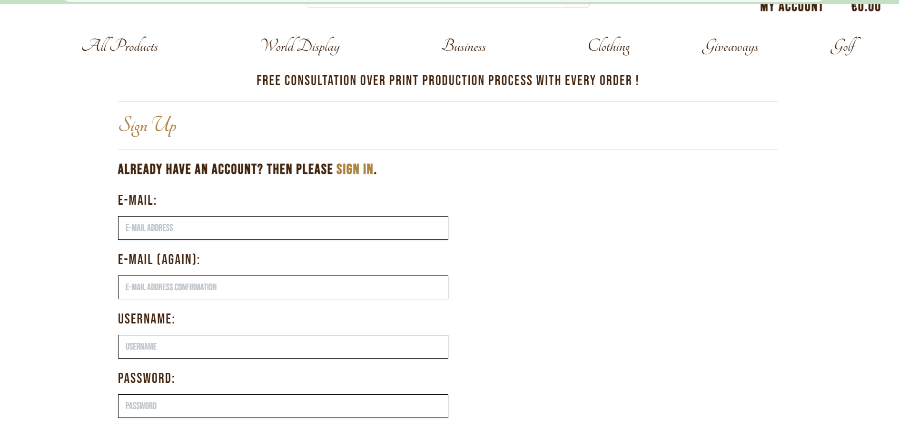
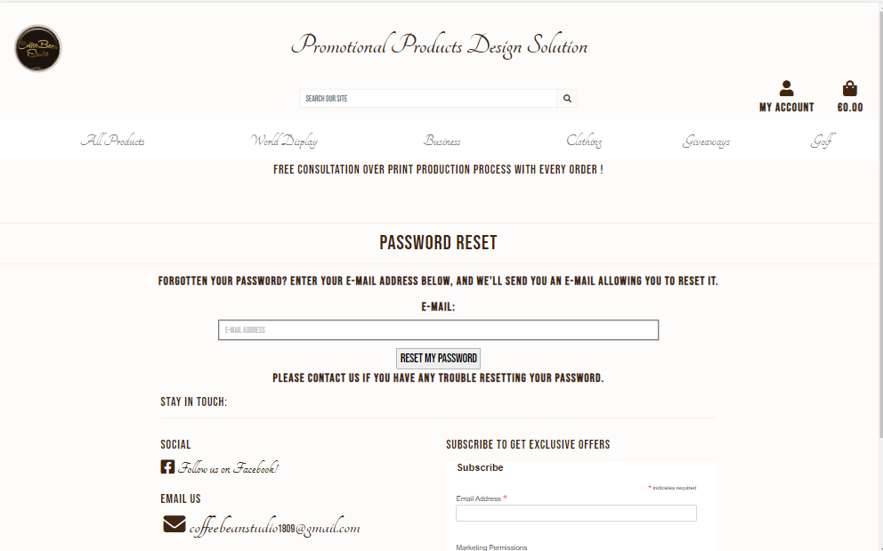

# Testing

Return back to the [README.md](README.md) file.

## Code Validation

### HTML

I have used the recommended [HTML W3C Validator](https://validator.w3.org) to validate all of my HTML files.

- https://validator.w3.org/nu/?doc=https%3A%2F%2Fcoffeebeanstudio1809-7c1114e7ca53.herokuapp.com%2F

| Page | W3C URL | Screenshot | Notes |
| --- | --- | --- | --- |
| Home | [W3C](https://validator.w3.org/nu/?doc=https%3A%2F%2Fcoffeebeanstudio1809-7c1114e7ca53.herokuapp.com%2F) |  | Pass: No Errors  |
| Bag | [W3C](https://validator.w3.org/nu/?doc=https%3A%2F%2Fcoffeebeanstudio1809-7c1114e7ca53.herokuapp.com%2Fbag%2F) |  | Pass: No Errors |
| Profile | [W3C](https://validator.w3.org/nu/?doc=https%3A%2F%2Fcoffeebeanstudio1809-7c1114e7ca53.herokuapp.com%2Fprofile%2F) |  | Pass: No Errors |
| Product View |[W3C](https://validator.w3.org/nu/?doc=https%3A%2F%2Fcoffeebeanstudio1809-7c1114e7ca53.herokuapp.com%2Fdesignproducts%2F%3Fcategory%3Dbanners) |  | Pass: No Errors |
| Checkout | [W3C](https://validator.w3.org/nu/?doc=https%3A%2F%2Fcoffeebeanstudio1809-7c1114e7ca53.herokuapp.com%2Fcheckout%2F) |  | Pass: No Errors |

### CSS

I have used the recommended [CSS Jigsaw Validator](https://jigsaw.w3.org/css-validator) to validate all of my CSS files.

| File | Jigsaw URL | Screenshot | Notes |
| --- | --- | --- | --- |
| style.css | [Jigsaw](https://jigsaw.w3.org/css-validator/validator?uri=https%3A%2F%2FAlena18.github.io%2FCoffeebeanstudio1809) |  | Pass: No Errors |
| checkout.css | [Jigsaw](https://jigsaw.w3.org/css-validator/#validate_by_input)|  | Pass: No Errors |
| profile.css | [Jigsaw](https://jigsaw.w3.org/css-validator/#validate_by_input) |  | Pass: No Errors |

### JavaScript

I have used the recommended [Jshint](https://jshint.com/) to validate all of my Javascript files.

| File | Screenshot | Notes |
| --- | --- | --- |
| stripe_elements.js |  | Undefined variable that defines according to stripe website |
| questions.js |  | Pass: No Errors |

### Python

I have used the recommended [PEP8 CI Python Linter](https://pep8ci.herokuapp.com) to validate all of my Python files.

| File | CI URL | Screenshot | Notes |
| --- | --- | --- | --- |
| manage.py | [PEP8 CI](https://github.com/Alena18/Coffeebeanstudio1809/blob/main/manage.py) |  | Pass: No Errors |
| settings.py before validation | [PEP8 CI](https://github.com/Alena18/Coffeebeanstudio1809/blob/main/coffeebeanstudio1809/settings.py) |  | Few errors, all fixed |
| settings.py after validation | [PEP8 CI](https://github.com/Alena18/Coffeebeanstudio1809/blob/main/coffeebeanstudio1809/settings.py) |  | Pass: No Errors |
| custom_storages.py | [PEP8 CI](https://github.com/Alena18/Coffeebeanstudio1809/blob/main/custom_storages.py) |  | Pass: No Errors |
| Coffeebeanstudio1809 url.py | [PEP8 CI](https://github.com/Alena18/Coffeebeanstudio1809/blob/main/coffeebeanstudio1809/asgi.py) |  | Pass: No Errors |
| Coffeebeanstudio1809 view.py | [PEP8 CI](https://github.com/Alena18/Coffeebeanstudio1809/blob/main/coffeebeanstudio1809/views.py) |  | Pass: No Errors |
| Coffeebeanstudio1809 wsgi.py | [PEP8 CI](https://github.com/Alena18/Coffeebeanstudio1809/blob/main/coffeebeanstudio1809/wsgi.py) |  | Pass: No Errors |
| Bag app.py | [PEP8 CI](https://github.com/Alena18/Coffeebeanstudio1809/blob/main/bag/apps.py) |  | Pass: No Errors |
| Bag context.py before validation| [PEP8 CI](https://github.com/Alena18/Coffeebeanstudio1809/blob/main/bag/contexts.py) |  | Few errors, all fixed |
| Bag context.py after validation| [PEP8 CI](https://github.com/Alena18/Coffeebeanstudio1809/blob/main/bag/contexts.py) |  | Pass: No Errors |
| Bag url.py after validation| [PEP8 CI](https://github.com/Alena18/Coffeebeanstudio1809/blob/main/bag/urls.py) |  | Pass: No Errors |
| bag view.py after validation| [PEP8 CI](https://github.com/Alena18/Coffeebeanstudio1809/blob/main/bag/views.py) |  | Pass: No Errors |
| Checkout admin.py | [PEP8 CI](https://github.com/Alena18/Coffeebeanstudio1809/blob/main/checkout/admin.py) |  | Pass: No Errors |
| Checkout app.py | [PEP8 CI](https://github.com/Alena18/Coffeebeanstudio1809/blob/main/checkout/apps.py) |  | Pass: No Errors |
| Checkout forms.py | [PEP8 CI](https://github.com/Alena18/Coffeebeanstudio1809/blob/main/checkout/forms.py) |  | Pass: No Errors |
| Checkout model.py | [PEP8 CI](https://github.com/Alena18/Coffeebeanstudio1809/blob/main/checkout/models.py) |  | Pass: No Errors |
| Checkout signals.py | [PEP8 CI](https://github.com/Alena18/Coffeebeanstudio1809/blob/main/checkout/signals.py) |  | Pass: No Errors |
| Checkout urls.py | [PEP8 CI](https://github.com/Alena18/Coffeebeanstudio1809/blob/main/checkout/urls.py) |  | Pass: No Errors |
| Checkout view.py | [PEP8 CI](https://github.com/Alena18/Coffeebeanstudio1809/blob/main/checkout/views.py) |  | Pass: No Errors |
| Checkout webhook_handler.py.py | [PEP8 CI](https://github.com/Alena18/Coffeebeanstudio1809/blob/main/checkout/webhook_handler.py) |  | Pass: No Errors |
| Checkout webhooks.py | [PEP8 CI](https://github.com/Alena18/Coffeebeanstudio1809/blob/main/checkout/webhooks.py) |  | Pass: No Errors |
| Design apps.py | [PEP8 CI](https://github.com/Alena18/Coffeebeanstudio1809/blob/main/design/apps.py) |  | Pass: No Errors |
| Design url.py | [PEP8 CI](https://github.com/Alena18/Coffeebeanstudio1809/blob/main/design/urls.py) |  | Pass: No Errors |
| Design view.py | [PEP8 CI](https://github.com/Alena18/Coffeebeanstudio1809/blob/main/design/views.py) |  | Pass: No Errors |
| Designproduct admin.py | [PEP8 CI](https://github.com/Alena18/Coffeebeanstudio1809/blob/main/designproducts/admin.py) |  | Pass: No Errors |
| Designproduct apps.py | [PEP8 CI](https://github.com/Alena18/Coffeebeanstudio1809/blob/main/designproducts/apps.py) |  | Pass: No Errors |
| Designproduct forms.py | [PEP8 CI](https://github.com/Alena18/Coffeebeanstudio1809/blob/main/designproducts/forms.py) |  | Pass: No Errors |
| Designproduct models.py | [PEP8 CI](https://github.com/Alena18/Coffeebeanstudio1809/blob/main/designproducts/models.py) |  | Pass: No Errors |
| Designproduct urls.py | [PEP8 CI](https://github.com/Alena18/Coffeebeanstudio1809/blob/main/designproducts/urls.py) |  | Pass: No Errors |
| designproduct widget.py | [PEP8 CI](https://github.com/Alena18/Coffeebeanstudio1809/blob/main/designproducts/widgets.py) |  | Pass: No Errors |
| designproduct view.py | [PEP8 CI](https://github.com/Alena18/Coffeebeanstudio1809/blob/main/design/views.py) |  | Pass: No Errors |
| Profiles apps.py | [PEP8 CI](https://github.com/Alena18/Coffeebeanstudio1809/blob/main/profiles/apps.py) |  | Pass: No Errors |
| Profiles forms.py | [PEP8 CI](https://github.com/Alena18/Coffeebeanstudio1809/blob/main/profiles/forms.py) |  | Pass: No Errors |
| Profiles models.py | [PEP8 CI](https://github.com/Alena18/Coffeebeanstudio1809/blob/main/profiles/models.py) |  | Pass: No Errors |
| Profiles urls.py | [PEP8 CI](https://github.com/Alena18/Coffeebeanstudio1809/blob/main/profiles/urls.py) |  | Pass: No Errors |
| Profiles view.py | [PEP8 CI](https://github.com/Alena18/Coffeebeanstudio1809/blob/main/profiles/views.py) |  | Pass: No Errors |

## Browser Compatibilitys

I tested website using next browsers:

Recommended browsers to consider:
- [Chrome](https://www.google.com/chrome)
- [Firefox (Developer Edition)](https://www.mozilla.org/firefox/developer)
- [Edge](https://www.microsoft.com/edge)
- [Safari](https://support.apple.com/downloads/safari)
- [Brave](https://brave.com/download)
- [Opera](https://www.opera.com/download)

| Browser | Screenshot | Notes |
| --- | --- | --- |
| Chrome |  | Works as expected |
| Firefox |  | Works as expected |
| Edge |  | Works as expected |
| Brave |  | Works as expected |
| Opera |  | Minor differences |

## Responsiveness

I've tested my deployed project on multiple devices (mobile, tablet,  desktop) to check for responsiveness issues.

| Device | Screenshot | Notes |
| --- | --- | --- |
| Mobile (DevTools) |  | Works as expected |
| Tablet (DevTools) |  | Works as expected |
| Desktop |  | Works as expected |
| Ipad mini |  | Works as expected |
| Surface Pro 7 |  | Works as expected |

## Lighthouse Audit

I've tested my deployed project using the Lighthouse Audit tool to check for any major issues and follow recommendation to make site more accessible.

| Page | Size | Screenshot | Notes |
| --- | --- | --- | --- |
| Home | Desktop |  | Few warnings |
| Home | Mobile |  | Some minor warnings |
| Product view | Desktop |  | Few warnings |
| Product view | Mobile |  | Some minor warnings |
| Bag | Desktop |  | Few warnings |
| Bag | Mobile |  | Some minor warnings |

## Defensive Programming

I implement next defensive features:

Forms:
- Users cannot submit an empty form
- Users must enter valid email addresses

Defensive programming was manually tested with the below user acceptance testing:

| Page | User Action | Expected Result | Pass/Fail | Comments |
| --- | --- | --- | --- | --- |
| Home Page | | | | |
| | Click on Logo | Redirection to Home page | Pass | |
| | Click on Home link in navbar | Redirection to Product View page | Pass | |
| Product View Page | | | | |
| | Click on image | Redirection to Product Detail page | Pass | |
| Product Detail Page | | | | |
| | Add to bag  | Toast notice shows up | Pass | |
| | Click on cart | Redirection to Cart page  | Pass | |
| Cart Page | | | | |
| | Edit/Remove button | Check if edit/remove button works | Pass | |
| | Click to Checkout | Redirects to payment system | Pass | |
| | Click the Pay button | Redirects user to home page | Pass |
| Sign Up | | | | |
| | Click on Sign Up button | Redirection to Sign Up page | Pass | |
| | Enter valid email address | Field will only accept email address format | Pass | |
| | Enter valid password (twice) | Field will only accept password format | Pass | |
| | Click on Sign Up button | Asks user to confirm email page | Pass | Email sent to user |
| | Confirm email | Redirects user to blank Sign In page | Pass | |
| Log In | | | | |
| | Click on the Login link | Redirection to Login page | Pass | |
| | Enter valid email address | Field will only accept email address format | Pass | |
| | Enter valid password | Field will only accept password format | Pass | |
| | Click Login button | Redirects user to home page | Pass | |
| Log Out | | | | |
| | Click Logout button | Redirects user to logout page | Pass | Confirms logout first |
| | Click Confirm Logout button | Redirects user to home page | Pass | |
| Profile | | | | |
| | Click on Profile button | User will be redirected to the Profile page | Pass | |
| | Click on the Edit button | User will be redirected to the edit profile page | Pass | |
| | Click on the My Orders link | User will be redirected to the My Orders page | Pass | |
| | Brute forcing the URL to get to another user's profile | User should be given an error | Pass | Redirects user back to own profile |

## User Story Testing

| User Story | Screenshot |
| --- | --- |
| As a new site user, I would like to be able to view a list of products, so that I can select some to purchase. |  |
| As a new site user, I would like to view individual product details, so that I can identify the price, description, product rating. |  |
| As a new site user, I would like to quickly identify deals, clearance items and special offers, so that I can take advantage of special savings on products user like to purchase. |  |
| As a new site user, I would like to easily view the total of my purchases at any time , so that I can avoid spending too much. |  |
| As a new site user, I would like to sort the list of available products, so that I can easily identify the best rated, best priced and categorically sorted products. |  |
| As a returning site user, I would like to easily register for an account, so that I can have a personal account and be able to view my profile. |  |
| As a returning site user, I would like to easily login, so that I can access my personal account information. |  |
| As a returning site user, I would like to easily logout, so that I can access my personal account information. |  |
| As a returning site user, I would like to easily recover my password in case user forget it, so that I can recover access to my account. |  |
| As a returning site user, I would like to receive an email confirmation after registering , so that I can verify that my account registration was successful. |  |
| As a returning site user, I would like to have a personalized user profile, so that I can view my personal order history and order confirmation and save my payment information. |  |

## Bugs

| Bug | Status |
| --- | --- |
| [Heroku App](documents/apptail.png) | Closed |

| How it was fixed | Screenshot |
| --- | --- |
| Use Terminal |  [screenshot](documentation/bug.png) |
| Use Terminal |  [screenshot](documentation/debug.png) |
| Procfile |  [screenshot](documentation/procfile.png) |
| Solved |  [screenshot](documentation/profilesort.png) |
| Quantity button |  [screenshot](documentation/button.png) |
| Quantity button fix by Chris CodeInstitute |  [screenshot](documentation/buttonfix.png) |

## Unfixed Bugs

There are no remaining bugs that I am aware of.